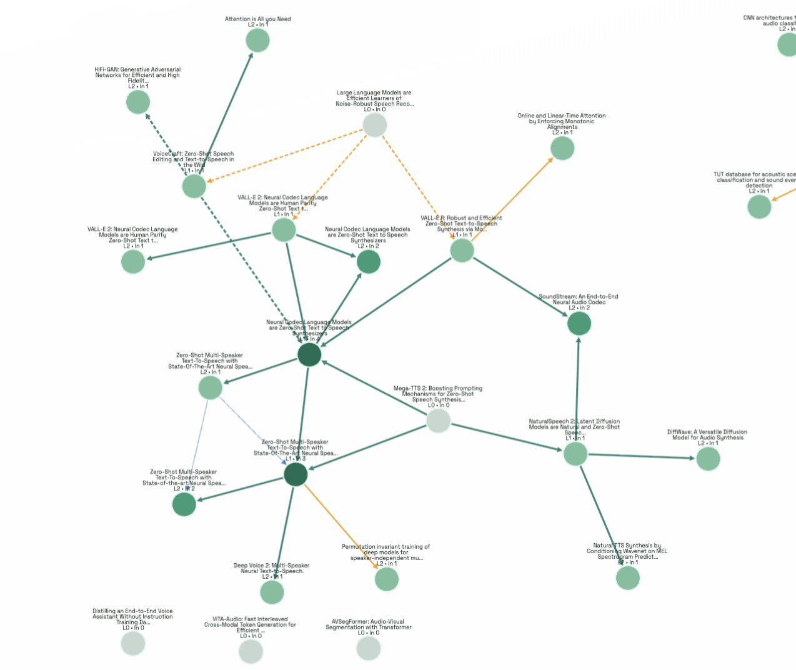

# Paper Explorer

Paper Explorer is a research webapp for discovering papers, saving favorites, generating structured paper analysis, and tracing method lineage with interactive graphs.

## Product Visual Overview

### 1) Paper Search Engine
Use topic or paper-name search with conference/year filters, then browse ranked results and save papers.


### 2) Paper Detail + Lineage Graph
Open a paper to inspect concise analysis (problem/gap/method, logic/evidence, limitations, dependencies), then run trace-back to visualize methodological ancestry.


### 3) Favorites + Cross-Paper Links
Save papers into Favorites, then visualize links across selected favorites in a combined graph to compare clusters and related work.



## What This Webapp Supports

- Topic or paper-name discovery with conference/year filters
- Persistent favorites list (database-backed)
- Cached paper detail + summary for fast reopen
- Recursive trace-back graph generation
- Combined favorites graph with inferred related links
- Node-click exploration from graphs back into paper detail

## Quick Start

### 1) Install

```bash
python3 -m venv .venv
source .venv/bin/activate
pip install -r requirements.txt
```

### 2) Configure (optional)

```bash
export OPENAI_API_KEY=your_key_here
export OPENAI_MODEL=gpt-4o-mini
export SEMANTIC_SCHOLAR_API_KEY=your_semantic_scholar_key_here
```

Optional runtime config:

```bash
export DATABASE_URL=sqlite:///./paper_reading.db
export OPENAI_API_URL=https://api.openai.com/v1/chat/completions
export LLM_CACHE_PATH=llm_cache.db
```

### 3) Run

```bash
uvicorn app.main:app --reload
```

Open: `http://127.0.0.1:8000`

## Technical Docs

Implementation/system diagrams and API documentation are moved here:

- [Technical Reference](TECHNICAL_REFERENCE.md)

## Project Structure

```text
app/
  main.py
  trace.py
  paper_analysis.py
  llm.py
  scholar.py
  conference_scraper.py
  models.py
  schemas.py
  db.py

static/
  index.html
  app.js
  favorites_links.html
  favorites_links.js
  style.css
```
