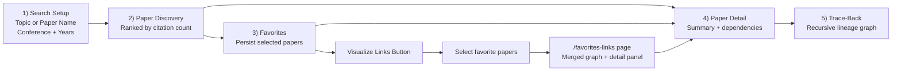
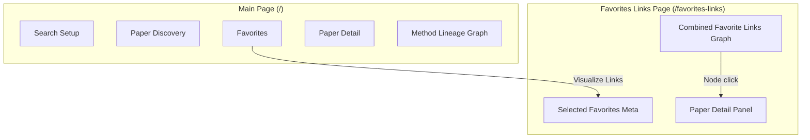
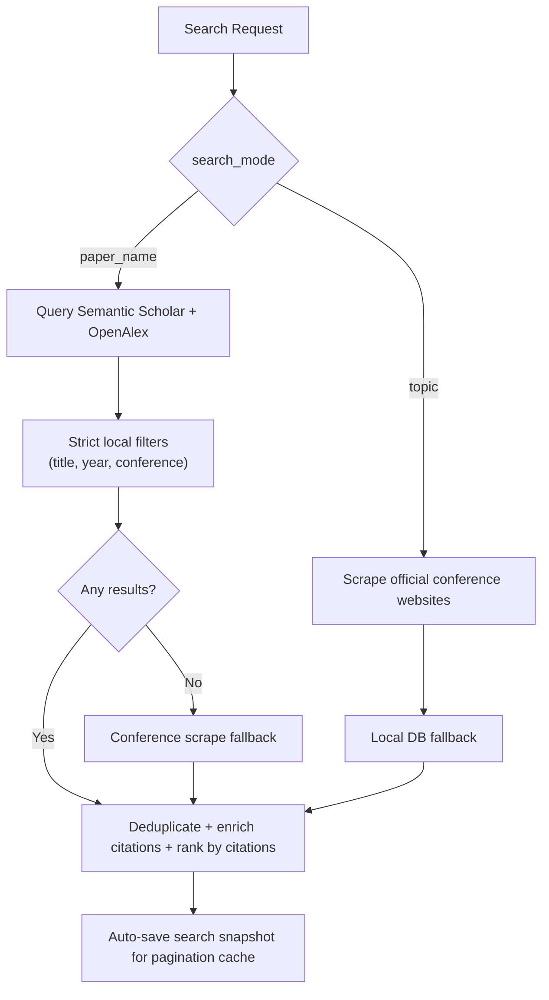
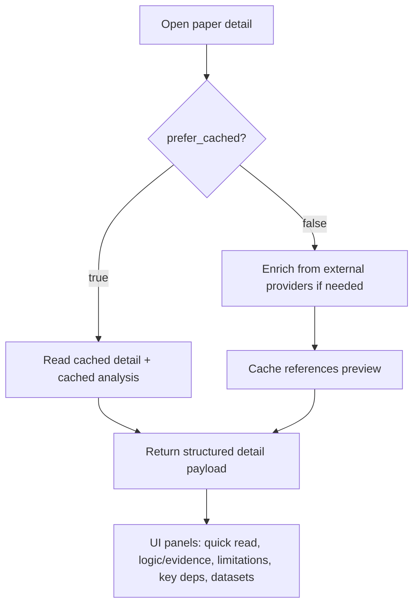
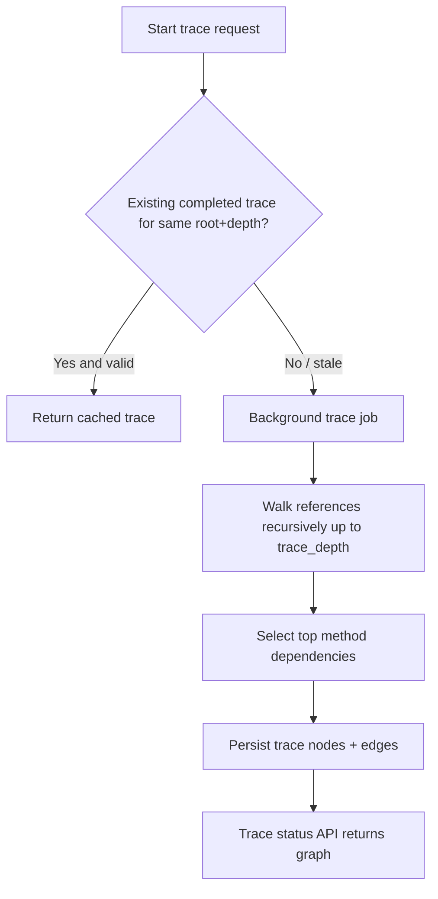
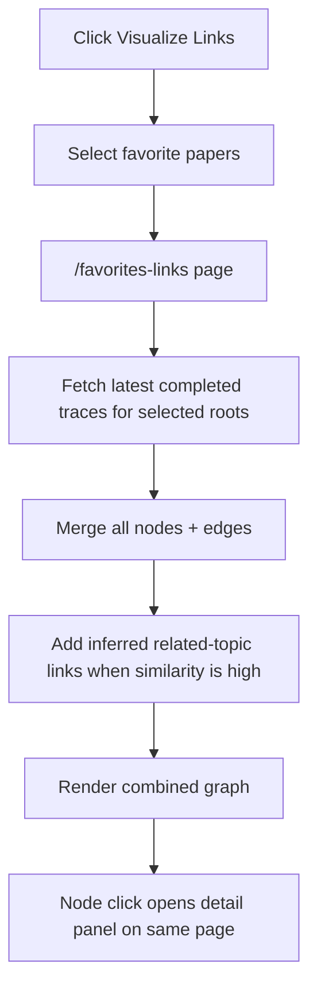
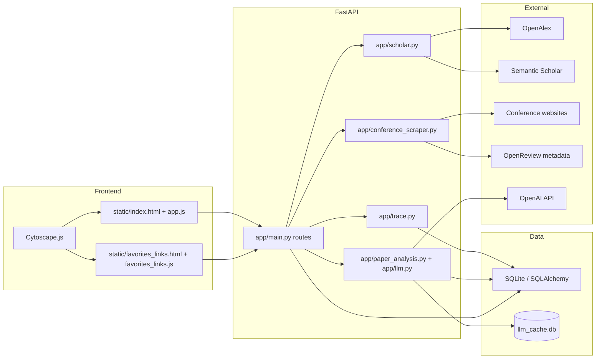
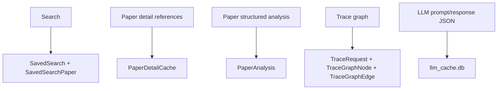
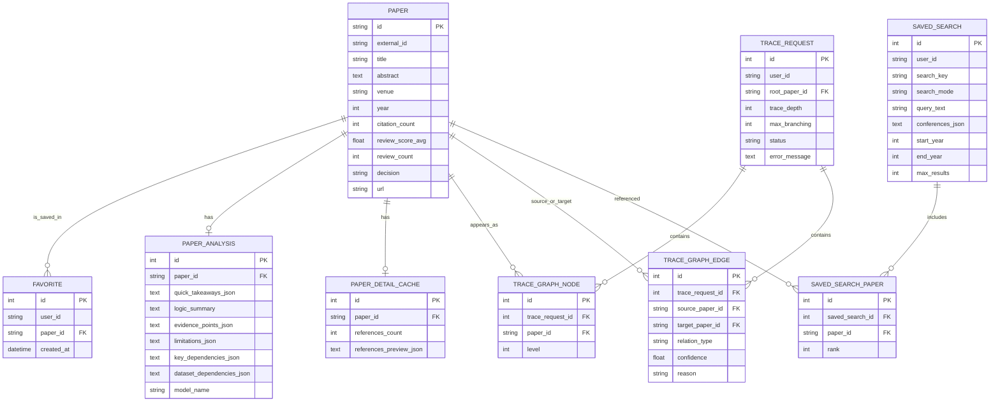

# Technical Reference

## Webapp Flow (Visual)

---

## Interface Map

---

## Core Functionalities (with diagrams)

### 1) Search (Topic mode vs Paper-name mode)

What you get:
- Pagination-friendly results (10 per page)
- Saved-search reuse to avoid re-scraping/re-querying on page flips

### 2) Paper Detail + Analysis

Analysis behavior:
- Uses LLM when `OPENAI_API_KEY` is set
- Falls back to heuristics if LLM unavailable
- Limitations are inferred from discussion/conclusion context when available

### 3) Recursive Trace-Back

Graph semantics:
- Node click: opens paper detail
- Edge click: concise reason text
- Edge color: relation confidence tier
- Node color intensity: incoming-edge count (cited-by count **inside graph**)

### 4) Favorites Links Graph (cross-paper merge)

Important behavior:
- If selected papers are unrelated, they remain separate components
- Related components get inferred links

---

## Architecture

---

## Caching Strategy (why repeated opens are fast)

Practical impact:
- Paginating search does not re-scrape
- Reopening favorited papers uses cached summary/analysis
- Reopening trace graphs reuses stored nodes/edges

---

## Database Schema (ER)

---

## API Surface

| Method | Endpoint | Purpose |
|---|---|---|
| `GET` | `/` | Main web app page |
| `GET` | `/favorites-links` | Dedicated merged-favorites graph page |
| `POST` | `/api/papers/search` | Search papers |
| `GET` | `/api/papers/{paper_id}` | Get paper detail + analysis |
| `POST` | `/api/searches/save` | Save current search snapshot |
| `POST` | `/api/favorites` | Add favorite |
| `DELETE` | `/api/favorites/{paper_id}?user_id=...` | Remove favorite |
| `GET` | `/api/favorites?user_id=...` | List favorites |
| `POST` | `/api/favorites/links-graph` | Build merged graph from selected favorites |
| `POST` | `/api/traces` | Start trace-back job |
| `GET` | `/api/traces/{trace_id}` | Poll trace status/result |
| `GET` | `/api/traces/by-paper/latest?paper_id=...&user_id=...` | Load latest cached trace for a paper |

---

